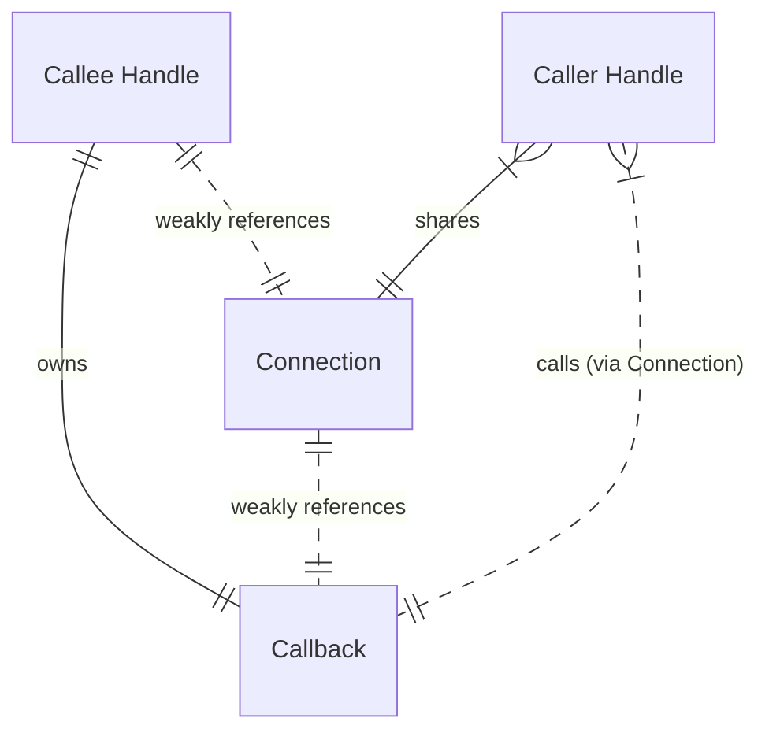
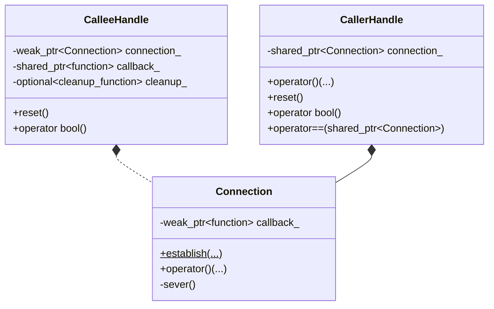
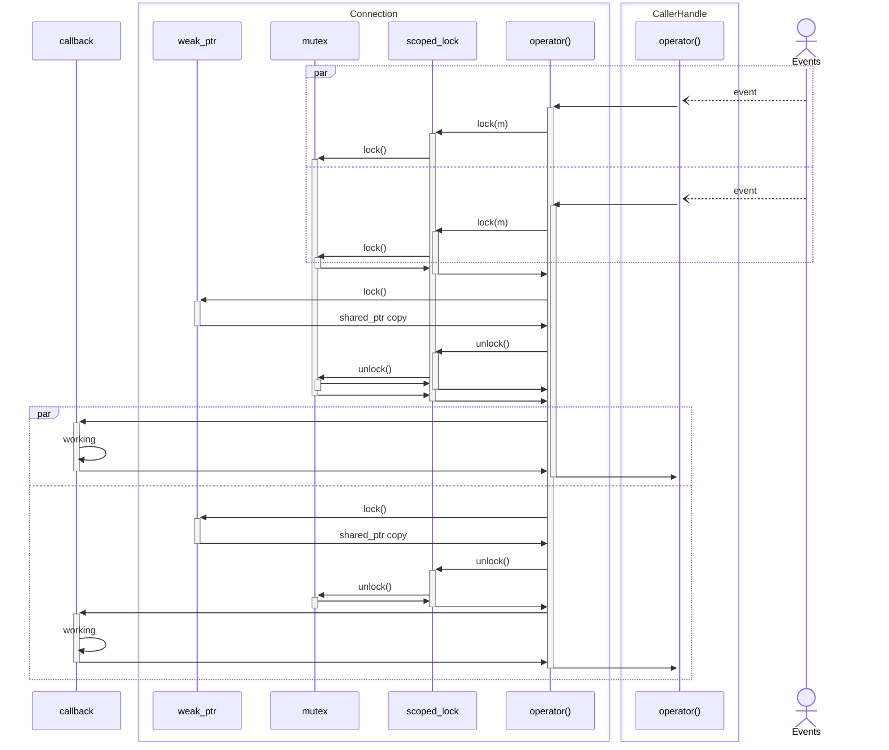
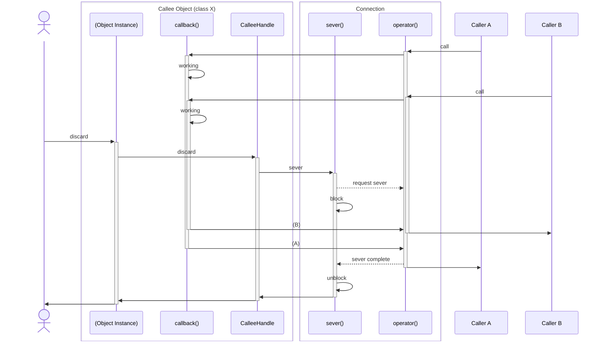
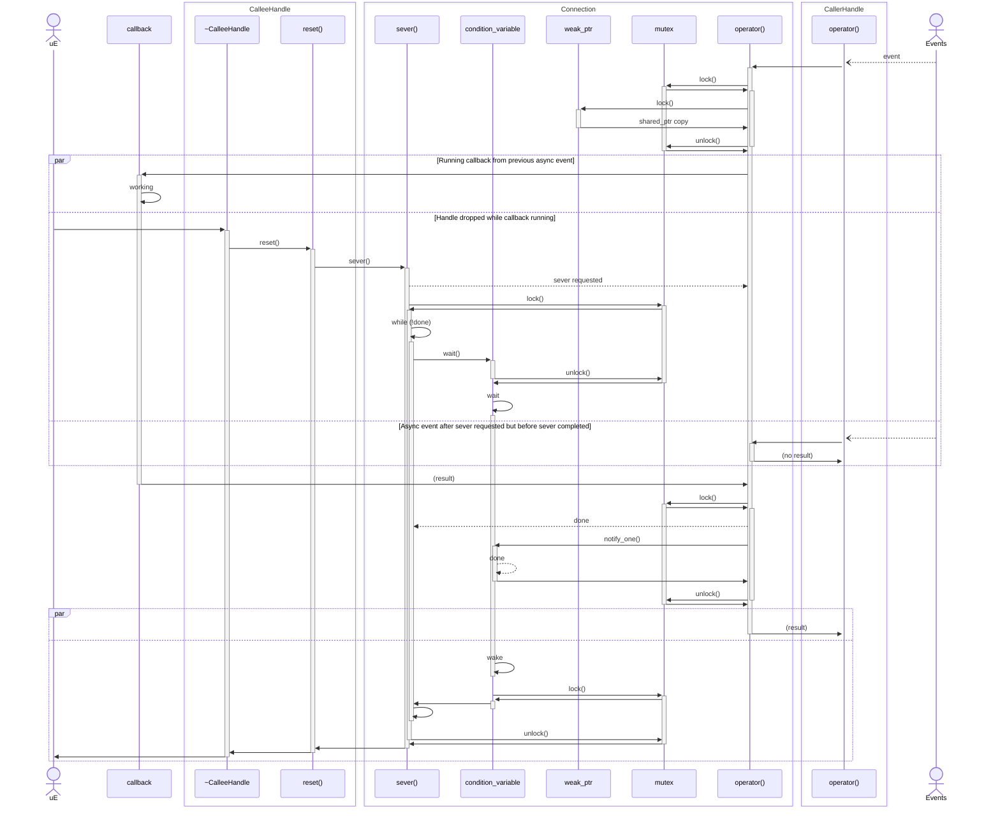

# Callback Connection: Scope-managed callbacks as connected pairs of handles

The Callback Connection module aims to improve safety around the use of
callback functions. It provides each participant in a callback relationship,
the _Caller(s)_ and _Callee_, a handle representing that connection. When
either handle is discarded, the connection is broken with no manual
intervention (i.e. unregistering the callback) required.

## Background
One of the core philosphies behind modern C++ is _Resource Acquisition is
Intialization_, or **RAII**, wherein the core tenets are:

* Resource acquisition occurs at object creation
* Resource release occurs at destruction

Which is to say, resources are only held while the owning object exists.
Combined with C++'s destroy-at-scope-exit object lifecycle management, this
provides a critical safety advantage over separate acquisition and release
semantics. Regardless of the code path taken to exit a scope, the required
resource release will occur.

As the C++ Core Guidelines puts it: [Don't leak any resources][cpp-core-raii].

This philosophy is applied throughout the C++ Standard Library. For example,
[`std::unique_ptr`][cpp-ref-uniq] replaces paired `new`/`delete` calls with
a scoped object. Discard the `unique_ptr` and the memory resource it holds
is released.

## Design

The Callback Connection module provides an RAII model for representing a
connection between an owner and a user of a callback function. This function
serves as the resource, with the owner of this resource (the _callee_) creating
a connection to a non-owning _caller_ that is expected to utilize the callback
function in the future. Each participant in this connection is provided a
handle that, when discarded, automatically severs the connection.



The combination of shared, owned, and weak reference relationships allows for
either end to break the connection. In our implementation, we will use
[`std::shared_ptr`][cpp-ref-shared] and [`std::weak_ptr`][cpp-ref-weak] to form
these relationships.

The _Caller Handle_ breaks the connection simply by dropping its instance of
the connection `shared_ptr` - once no more _Caller Handles_ hold a `shared_ptr`
to the connection, the _Callee Handle's_ `weak_pointer` will become invalid
(so long as it was not [locked][cpp-ref-weak-lock]).

The _Callee Handle_ must take slightly more care when severing the connection.
This is because the callback function may access external resources that may
become unavailable once the _Callee Handle_ believes the conneciton is broken.
As such, when the _Callee Handle_ attempts to sever the connection, it must
set a flag in the _Connection_ to prevent any new callbacks from executing,
then wait until all currently execting callbacks have completed. Additional
details of this behavior are discussed in the section on thread safety below.

### Interface and Class Composition

This module will provide interfaces through three objects:

* `Connection`
* `CallerHandle`
* `CalleeHandle`



The `Connection` object represents the connection between the two handles.
It is templated on both the return type and argument types of the callback
function. Pairs of connected handles are created using its static `establish()`
method:

```
using Callback = std::function<ReturnT(Args...)>;
using Cleanup = std::function<void(shared_ptr<Connection>)>;
using ConnectedPair = std::tuple<CalleeHandle, CallerHandle>;

static ConnectedPair establish(Callback&& cb, std::optional<Cleanup>&& = {});
```

When establishing a connection, a callback function must be provided.
Additionally, an optional cleanup function can be provided that will be called
when the connection is broken from the _callee_ side. This will be provided
a value that can be checked against any held `CallerHandle` instances in a
container, such as might be found in a callback registry for a messaging
service.

As `CalleeHandle` owns the callback function, it is non-copyable. However, it
can be moved. The holder of a `CalleeHandle` can break the connection in one of
two ways: discarding the object, or calling `reset()` which restores
`CalleeHandle` to its default, non-connected state.

`CallerHandle` can be copied as it might need to be shared in the context of
providing a service (e.g. when serving callbacks using a thread pool). It
provides a function call operator that will check the status of the connection
then forward all arguments to the callback function. The holder(s) of a
`CalleeHandle` can break the connection by discarding or calling `reset()` on
 _all_ instances of the handle.

Both `CalleeHandle` and `CallerHandle` provide conversion operators to `bool`
that will return `true` if the connection is still active or `false` if the
connection has been severed.

### Thread Safety and Parallel Access

In many systems using callback functions, it is likely that the _Caller_ and
_Callee_ will operate from separate execution contexts. Further, some patterns
may allow for multiple simultaneous invokations of the same callback function.

On the _Caller_ side, each separate copy of the `CallerHandle` instance will
have a copy of the shared pointer to the `Connection` instance. Separate copies
of a `shared_ptr` are [guaranteed to be thread safe][cpp-ref-shared] - the
shared state is accessed and updated atomically. No additional locking is
required here.

In the middle of both handles is the `Connection` object. A single instance
is shared by both the _Callee Handle_ and all _Caller Handle_ copies. This
holds a `std::weak_ptr` to the callback function. Since this is a single
instance on the weak pointer object, manipulation of that weak pointer must
be guarded against concurrent access. This protection is implemented with
`std::mutex`, `std::condition_variable`, and `std::scoped_lock`:



Last is the _Callee_ side of the connection. The `CalleeHandle` for a given
connection cannot be copied and is expected to have a single owner. It is not
shared. As such, its implementation does not need to directly address
concurrency or locking.

#### Severing the Connection with Active Calls

There is one case where additional care is required around locking: severing
the connection from the _Callee_ side while there are active calls to the
callback function. We must ensure that resources used by the callbacks are
not released while they are still executing.

The owner of the _callee handle_ will, in most cases, have initialized the
resources the callback depends on before connecting the callback. When this is
the case, C++ will delete the resources in the reverse of the initialization
order. Consider this code:

```
int countEventRate() {
    atomic<int> eventsSeen{0};
    auto handle = listenForEvents([&eventsSeen]() { ++eventsSeen; });
    std::this_thread::sleep_for(1s);
    return eventsSeen;
}
```

The `handle` will be deleted before `eventsSeen`. In order to achieve our goal
of keeping resources alive until callbacks complete, the destruction of the
`handle` will need to block temporarily:



_Note: some elements omitted from the above diagram for simplicity._

This is implemented using a condition variable and some additional wait logic
to ensure the active callbacks have completed. Expanding the previous diagram
to show more of the implementation:



_Note: scoped_lock would be used for mutex management, but it is omitted from
the diagram to reduce complexity. The actions it would take on the mutex
are included instead._

[cpp-core-raii]: https://isocpp.github.io/CppCoreGuidelines/CppCoreGuidelines#Rp-leak
[cpp-ref-uniq]: https://en.cppreference.com/w/cpp/memory/unique_ptr
[cpp-ref-weak]: https://en.cppreference.com/w/cpp/memory/weak_ptr
[cpp-ref-shared]: https://en.cppreference.com/w/cpp/memory/shared_ptr
[cpp-ref-weak-lock]: https://en.cppreference.com/w/cpp/memory/weak_ptr/lock
[cpp-ref-atomic-weak]: https://en.cppreference.com/w/cpp/memory/weak_ptr/atomic2
[cpp-ref-cond-var]: https://en.cppreference.com/w/cpp/thread/condition_variable
